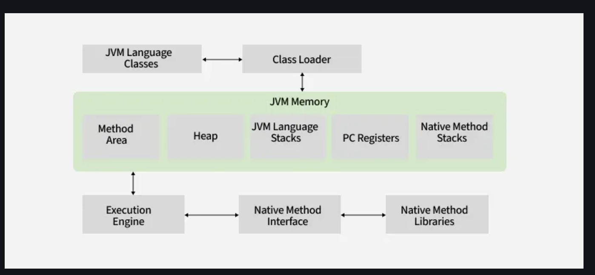

# Java basic


## 01_JDK_vs_JRE_vs_JVM

**Reference**
- https://www.geeksforgeeks.org/differences-jdk-jre-jvm/

---

**JDK vs JRE vs JVM**

- JDK:
    - Java Development Kit is a **software development environment** 
    - used for developing Java applications and applets.
- JRE: 
    - JRE stands for Java Runtime Environment, 
    - and it provides an environment to **run only the Java program** 
    - onto the **system**.
- JVM: 
    - JVM stands for Java Virtual Machine and is responsible for executing the Java program.


---

### JDK

**Working of JDK**
JDK enables the development and execution of Java programs.

1. **Java Source File**: 
    - You write the Java program in a **source file**.
2. **Compilation**: 
    - The source file is compiled by the Java Compiler (part of JDK) -> into bytecode, 
    - which is stored in a .class file.
3. **Execution**:
    - The bytecode is executed by the **JVM**
    - which interprets the bytecode and runs the Java program.

The following actions occur at runtime as listed below:

1. Class Loader
2. Byte Code Verifier
3. Interpreter

    3.1 Execute the Byte Code

    3.2 Make appropriate calls to the underlying hardware

---

### JRE

**only run(not develop)** the Java program (or application) onto your machine

**Working of JRE**

1. **Class Loader**: 
    - The JRE’s class loader loads the .class file containing the bytecode -> into memory.
2. **Bytecode Verifier**
    - JRE includes a bytecode verifier to ensure security before execution
3. **Interpreter**: 
    - JVM uses an interpreter + JIT compiler to execute bytecode for optimal performance
4. **Execution**:
    -  The program executes, making calls to the **underlying hardware and system resources** as needed.

---

**JVM (Java Virtual Machine)**

JVM is responsible for executing the java program **line by line**, hence it is also known as an **interpreter**.

**Note**

- JVM is platform -dependent (different JVMs for window, linux, macOS).
- Bytecode (.class files) is platform-independent (same file runs in any JVM).
- While JVM includes an interpreter, modern implementations primarily use JIT compilation for faster execution

**Working of JVM**

It is mainly responsible for three activities. 

1. Loading
2. Linking
3. Initialization



## 02_java_identifier

An identifier in Java is the name given to Variables, Classes, Methods, Packages, Interfaces, etc.

**Example**

```
public class Test
{
    public static void main(String[] args)
    {
        int a = 20;
    }
}
```

In the above Java code, we have 5 identifiers as follows: 

1. Test: Class Name
2. main: Method Name
3. String: Predefined Class Name
4. args: Variable Name
5. a: Variable Name

**Rules For Naming Java Identifiers**

- The only allowed characters for identifiers are all alphanumeric characters([A-Z],[a-z],[0-9]), ‘$‘(dollar sign) and ‘_‘ (underscore). 
    - BAD - “geek@”
- Identifiers should not start with digits([0-9]).
    - BAD - “123geeks” 
- Java identifiers are case-sensitive.
- There is no limit on the length of the identifier, but it is advisable to 
    - use an optimum length of 4 – 15 letters only.
- Reserved Words can’t be used as an identifier.
    - For example, “int while = 20;” 

**Reserved Words in Java**


# 03_java_keywords

keywords are the **reserved words** that have some predefined meanings and are used by the Java compiler for some internal process or represent some predefined actions.

**Reference**

- https://www.geeksforgeeks.org/java-keywords/

# 04_java_data_types

**Why Data Types Matter in Java?**

Data types matter in Java because of the following reasons, which are listed below:

- **Memory Efficiency** : Choosing the right type (byte vs int) -> saves memory.
- **Performance**: Proper types -> reduce runtime errors.
- **Code Clarity**: Explicit typing makes -> code more readable.

**Java Data Type Categories**

Java has two categories in which data types are segregated

1. Primitive Data Type: 
    - These are the basic building blocks that store simple values -> **directly in memory.** 
    - Examples of primitive data types are 
        1. boolean
        2. char
        3. byte
        4. short
        5. int
        6. long
        7. float
        8. double.
    - Note: The **Boolean with uppercase B** is a wrapper class for the primitive boolean type.
2. Non-Primitive Data Types (Object Types): 
    - These are reference types that -> **store memory addresses of objects.**
    - Examples of Non-primitive data types are String, Array, Class, Interface, and Object


### Primitive Data Types

1.  boolean Data Type
2.  byte Data Type
    - The byte data type is an 8-bit signed two’s complement integer. 
    - The byte data type is useful for -> **saving memory in large arrays.**
    - Size : 1 byte (8 bits)

3. short Data Type
    - The short data type is a **16-bit signed two’s complement integer.**
    - Size : 2 bytes (16 bits)

4. int Data Type
    - It is a **32-bit signed two’s complement integer.**
    - Size : 4 bytes ( 32 bits )

5. long Data Type

    - The long data type is a 64-bit signed two’s complement integer. 
    - It is used -> when an int **is not large enough** to hold a value, offering a much broader range.
    - Size : 8 bytes (64 bits)

6. float Data Type

    - The float data type is a single-precision 32-bit IEEE 754 floating-point. 
    - Use a float (instead of double) -> if you need to **save memory in large arrays** of floating-point numbers. The size of the float data type is 4 bytes (32 bits).
    - Size : 4 bytes (32 bits)

7. double Data Type

    - The double data type is a double-precision 64-bit IEEE 754 floating-point. 
    - For decimal values, this data type is generally the default choice. 
    - The size of the double data type is 8 bytes or 64 bits.
    Size : 8 bytes (64 bits)
        - Note:  Both float and double data types were designed especially for **scientific calculations**, where approximation errors are acceptable. If accuracy is the most prior concern then, it is recommended not to use these data types and use BigDecimal class instead. 

8. char Data Type
    
    - The char data type is a single 16-bit Unicode character with the size of 2 bytes (16 bits).
    - Size : 2 bytes (16 bits)
    - Why is the Size of char 2 bytes in Java?
        - Unlike languages such as C or C++ that use the ASCII character set
        -  Java uses the **Unicode character** set to support internationalization. Unicode requires more than 8 bits to represent a wide range of characters from different languages,

### Non-Primitive (Reference) Data Types

The Non-Primitive (Reference) Data Types will contain a **memory address** of variable values because

the reference types **won’t store** -> the variable value **directly -> in memory**. They are strings, objects, arrays, etc.

1. String
    -  Strings are defined as an array of characters.
    - The difference between a character array and a string in Java is, -> 
        - that the string is designed to hold a sequence of characters in a single variable whereas, 
        - a character array is a collection of separate char-type entities. Unlike C/C++ 
        - Java strings are not terminated with a null character.
            - The null terminator (\0) is a special character used primarily in C and C++ to mark the end of a string in a character array.
            - It tells the program where the string ends in memory.
2. Class

    - A Class is a user-defined blueprint or prototype from which objects are created.  It represents the set of properties or methods that are common to all objects of one type. In general, class declarations can include these components, in order:
        1. **Modifiers** : 
            - A class can be 
                1. public or 
                2. has default access. 
            - Refer to access specifiers for classes or interfaces in Java
        2. **Class name**: 
            - The name should begin with an initial letter (capitalized by convention).
        3. **Superclass(if any)**: 
            - The name of the class’s parent (superclass), 
            - if any, preceded by the keyword extends. A class can -> only extend (subclass) one parent.
        4. **Interfaces(if any)**: 
            - A comma-separated list of interfaces implemented by the class, 
            - if any, preceded by the keyword implements. 
            - A class can implement more than one interface.
        5. **Body**: The class body is surrounded by braces, { }.

3. Object

An Object is a basic unit of Object-Oriented Programming and represents real-life entities.  

A typical Java program creates many objects, which as you know, interact by invoking methods. An object consists of
    1. **State** 
        - It is represented by -> the **attributes** of an object.
        - It also reflects -> the **properties** of an object.
    2. **Behavior** : 
        - It is represented by the methods of an object.
        - It also reflects the response of an object to other objects.
    3. **Identity** : 
        - It gives a unique name to an object and enables one object to interact with other objects.

4. Interface

Like a class, an interface can have methods and variables, but the methods declared in an interface are by -> default abstract (only method signature, no body).

- Interfaces specify 
    - what a class
        1. must do and 
        2. not how.
    - It is -> the blueprint of the class.
- An Interface is about capabilities 
    - like a Player may be an interface and any class implementing Player must be able to (or must implement) move().
    - So it specifies a set of methods that the class has to implement.
- If a class implements an interface and does not provide method bodies for all functions specified in the interface, -> then the class must be declared abstract.
- A Java library example is Comparator Interface. 
    - If a class implements this interface, 
    - then it can be used to sort a collection.

5. Array

An Array is a group of like-typed variables that are referred to by a common name. Arrays in Java work differently than they do in C/C++. The following are some important points about Java arrays.

- In Java, all arrays are dynamically allocated. (discussed below)
- Since arrays are objects in Java, 
    - we can find their **length** -> using member length. 
    - This is different from C/C++ where we find length using size.
- A Java array variable can also be declared like other variables with [] after the data type.
- The variables in the array 
    - are ordered 
    - and each has an index beginning with 0.
- Java array can also be used as a 
    1. static field
    2.  a local variable
    3.  or a method parameter.
- The size of an array must be specified by
    -  => an int value 
    - and not long or short.
- The direct superclass of an array type is Object.
    - Every array type implements the interfaces Cloneable and java.io.Serializable.

### Key Points to Remember:

1. Strong Typing: 
    - Java enforces strict type checking 
        - at compile-time
        - => reducing runtime errors.
2. Memory Efficiency
    - Choosing the right data type based on the range and precision needed helps in efficient memory management.
3. Immutability of Strings
    - Strings in Java 
        - cannot be changed once created, 
        - !! ensuring safety in **multithreaded environments.**
4. Array Length
    - The length of arrays in Java 
        - is fixed once declared, 
        - and it can be accessed using the length attribute.

# 05_java_variables

In Java, variables are containers that store data in memory.

**Key Components of Variables in Java:**

A variable in Java has three components, which are listed below:

1. **Data Type:** 
    - Defines the kind of data stored (e.g., int, String, float).
2. **Variable Name:**
    - A unique identifier following Java naming rules.
3. **Value:**
    - The actual data assigned to the variable.

- Note: There are three types of variables in Java   
    1. Local
    2. Instance, 
    3. and a .

**How to Declare Java Variables?**

we need to take care of two things that are:

1. **data type:** 
    - In Java, a data type define the type of data that a variable can hold. 
2. **variable name:**
    - Must follow Java naming conventions (e.g., camelCase).

In this way, a name can only be given to a memory location. It can be assigned values in two ways: 
- Variable Initialization
- Assigning value by taking input

**How to Initialize Java Variables?**


**Types of Java Variables**

Now let us discuss different types of variables  which are listed as follows: 
1. Local Variables
2. Instance Variables
3. Static Variables

**1. Local Variables**

- A variable defined within a 
    1. block or 
    2. method or 
    3. constructor 
    - is called a local variable. 

The Local variable is created at the time of declaration and destroyed when the function completed its execution.
The scope of local variables exists only within the block in which they are declared.
We first need to initialize a local variable before using it within its scope.